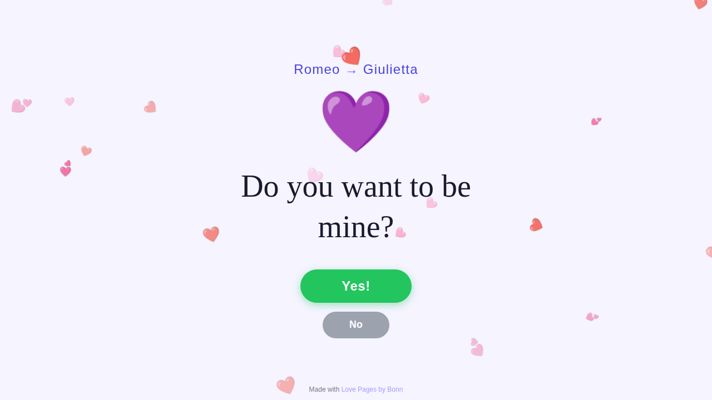
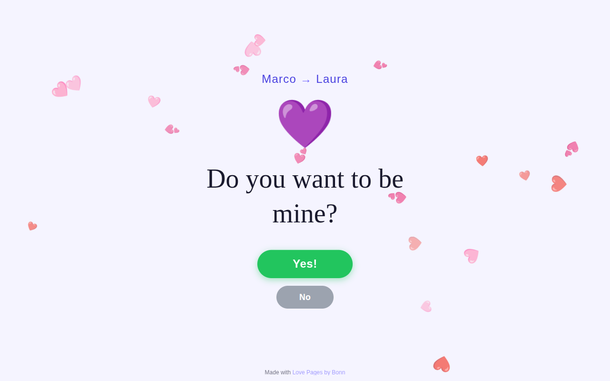
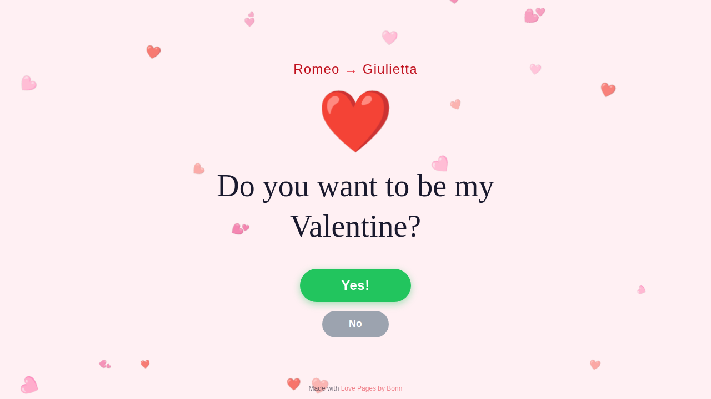
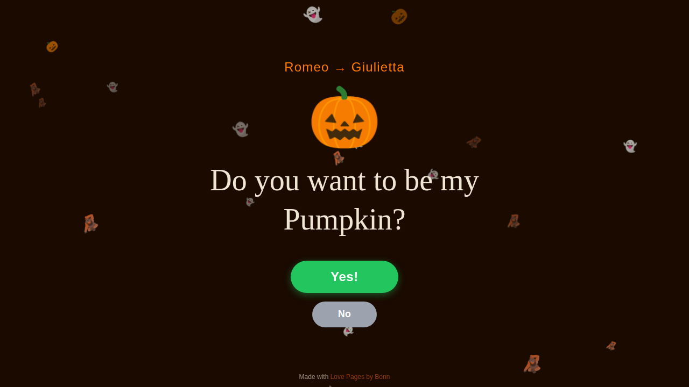
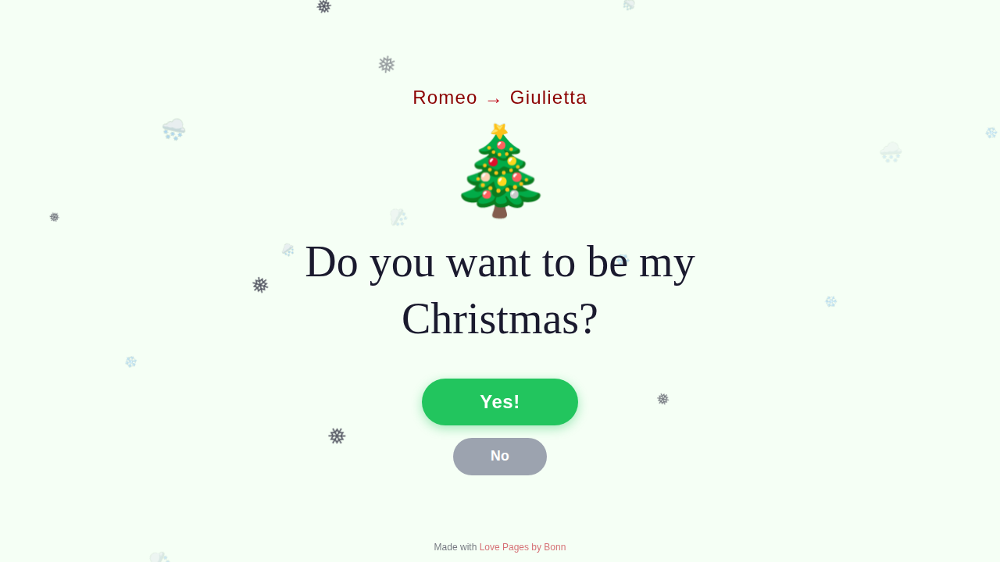
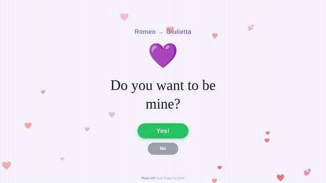
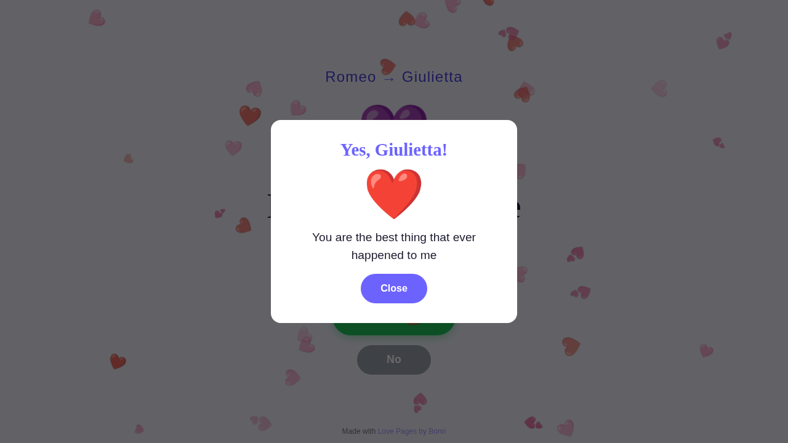
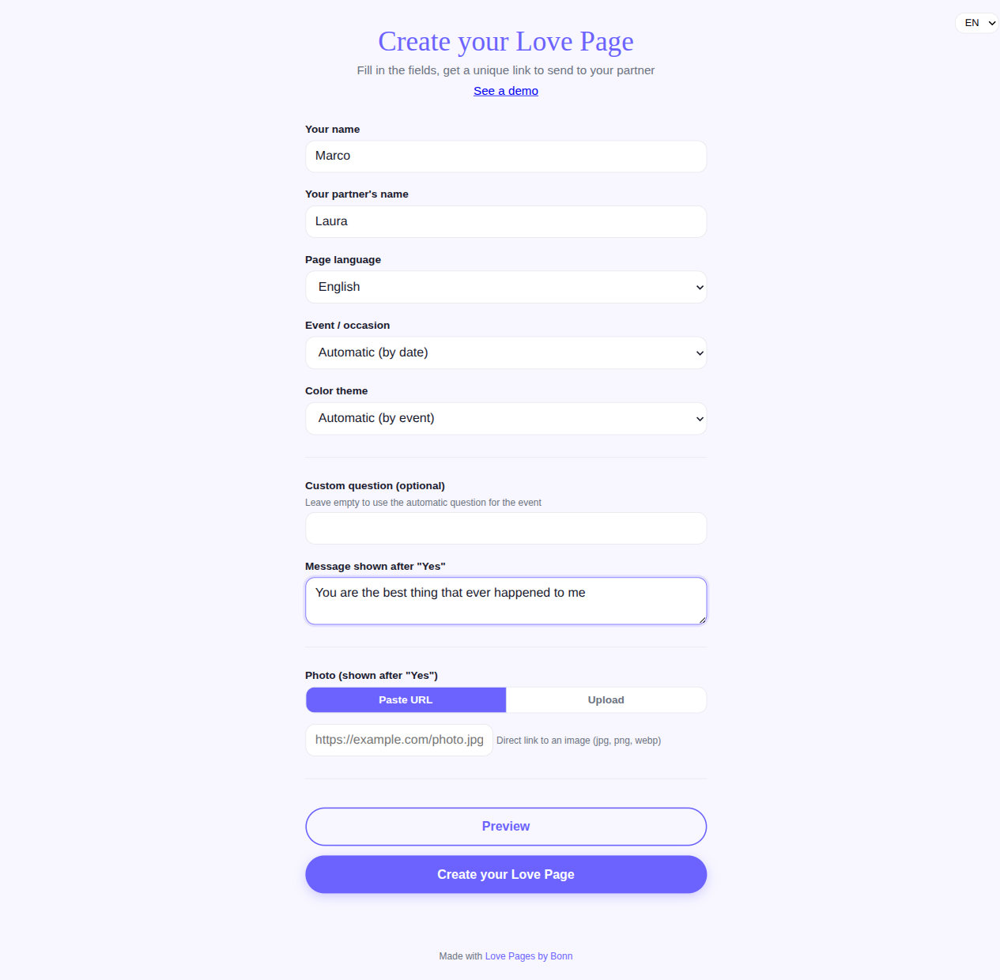
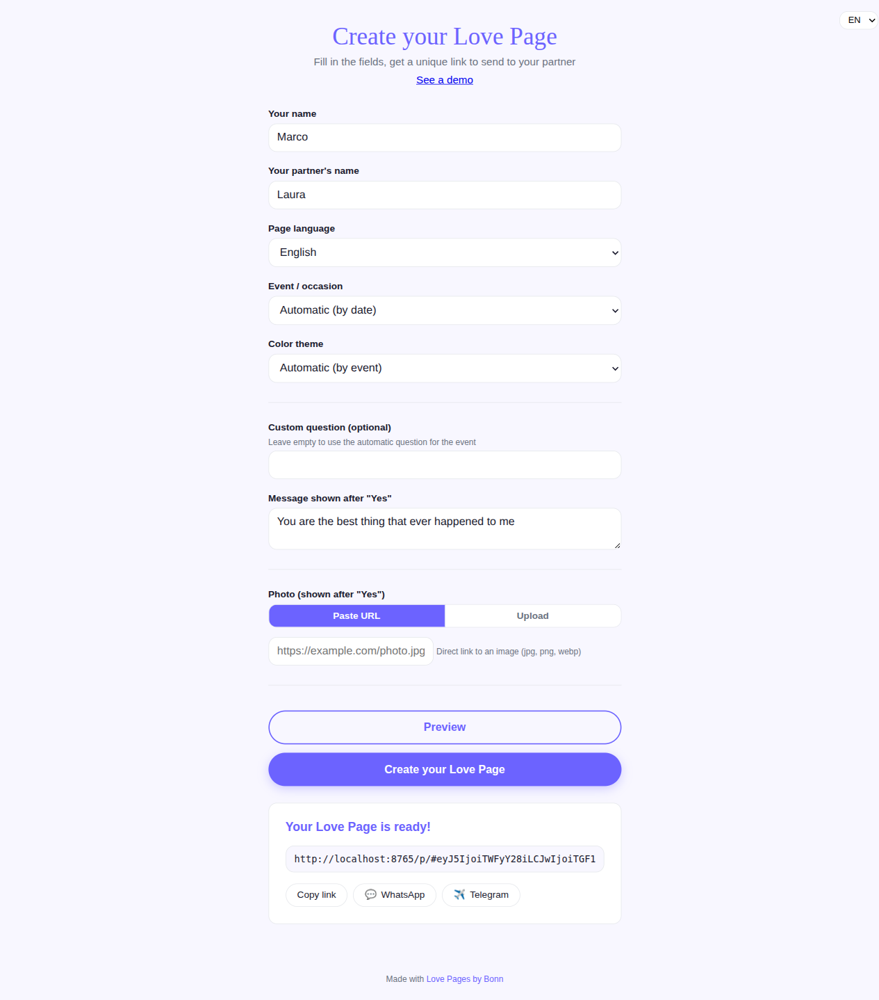

[English](README.md) | **Italiano**

# Love Pages by Bonn

Crea una pagina romantica personalizzata per il tuo partner in meno di 2 minuti. Non serve saper programmare, non serve un account. Compila un modulo e invia il link.

<div align="center">

[](https://github.com/AndreaBonn/love-pages-by-Bonn/actions/workflows/ci.yml)
[](https://github.com/AndreaBonn/love-pages-by-Bonn/actions/workflows/ci.yml)
[](https://github.com/AndreaBonn/love-pages-by-Bonn/actions/workflows/ci.yml)
[](LICENSE)
[](SECURITY.md)

</div>



---

## Cosa fa

Love Pages by Bonn genera una pagina a schermo intero con una domanda animata che cambia in base al periodo dell'anno. Il tuo partner può cliccare "Sì" (si apre un popup con la tua foto e un messaggio personalizzato) oppure "No" (che scappa dal cursore e non può mai essere cliccato).



La pagina adatta colori, particelle e testo della domanda a 9 eventi del calendario:

| Evento                  | Periodo          | Domanda                                  |
| ----------------------- | ---------------- | ---------------------------------------- |
| San Valentino           | 10 -- 14 Feb     | "Vuoi essere il mio/la mia Valentino/a?" |
| San Patrizio            | 14 -- 17 Mar     | "Vuoi essere il mio portafortuna?"       |
| Primavera               | 20 Mar -- 10 Apr | "Vuoi essere il mio fiore di primavera?" |
| Festa della Liberazione | 23 -- 25 Apr     | "Vuoi essere la mia Liberazione?"        |
| Solstizio d'Estate      | 18 -- 24 Giu     | "Vuoi essere il mio sole?"               |
| Halloween               | 27 -- 31 Ott     | "Vuoi essere la mia zucca?"              |
| Natale                  | 20 -- 26 Dic     | "Vuoi essere il mio Natale?"             |
| Anno Nuovo              | 28 Dic -- 2 Gen  | "Vuoi essere il mio Anno Nuovo?"         |
| Generico (fallback)     | Tutto l'anno     | "Vuoi essere mio/mia?"                   |

Ogni evento ha il suo tema colori, la sua emoji e le sue particelle animate di sfondo (cuori, fiocchi di neve, zucche, trifogli, ecc.).

|                    San Valentino                    |                      Halloween                      |                       Natale                        |
| :-------------------------------------------------: | :-------------------------------------------------: | :-------------------------------------------------: |
|  |  |  |

Il bottone "No" scappa ogni volta che provi a cliccarlo:



Quando il tuo partner clicca "Sì", un'esplosione di coriandoli rivela la tua foto e il tuo messaggio:



---

## Funzionalità

- Rilevamento automatico del calendario con 9 temi stagionali
- Particelle animate di sfondo (cuori, stelle, fiocchi di neve, trifogli, fiori, zucche)
- Bottone "No" che scappa dal cursore su desktop e dal tocco su mobile
- Bottone "Sì" che fa esplodere coriandoli e apre un popup con foto e messaggio
- Due lingue: inglese e italiano
- Tre override colore opzionali: dark, light, pastel
- Funziona su telefoni, tablet e desktop (da 320px a 2560px)
- Zero richieste esterne: nessun CDN, nessun analytics, nessun web font

---

## Due modi per usarlo

|                         | Configuratore online     | Fork su GitHub          |
| ----------------------- | ------------------------ | ----------------------- |
| **Per**                 | Tutti                    | Sviluppatori            |
| **Tempo**               | 2 minuti                 | 5 minuti                |
| **Richiede**            | Un browser               | Un account GitHub       |
| **Foto personalizzata** | Carica o incolla un link | Carica nel tuo repo     |
| **URL personalizzato**  | No (dominio condiviso)   | Sì (il tuo github.io)   |
| **Hosting**             | Incluso                  | GitHub Pages (gratuito) |

---

## Opzione A -- Configuratore online (senza codice)

Il modo più veloce. Non serve un account, non serve programmare, non serve installare nulla.

### Passo 1 -- Apri il configuratore

Vai sul sito di Love Pages e vedrai il modulo di configurazione.

### Passo 2 -- Compila il modulo

- **Il tuo nome** e **il nome del tuo partner** (obbligatori)
- **Lingua della pagina**: inglese o italiano
- **Evento**: scegli un'occasione specifica (San Valentino, Halloween, Natale...) oppure lascia "Automatico" per far scegliere la pagina in base alla data di oggi
- **Tema colori**: lascia "Automatico" oppure scegli scuro, chiaro o pastello
- **Domanda personalizzata** (opzionale): scrivi la tua domanda invece di quella automatica
- **Messaggio**: il testo mostrato dopo che il tuo partner clicca "Sì"



### Passo 3 -- Aggiungi una foto

Hai due opzioni:

- **Incolla URL**: se la tua foto è già online (es. condivisa da Google Drive, Imgur, o qualsiasi sito), incolla il link diretto
- **Carica**: clicca l'area di upload e seleziona una foto dal tuo dispositivo (max 5 MB, jpg/png/webp)

La foto è opzionale. Se la salti, verrà mostrata un'emoji cuore al suo posto.

### Passo 4 -- Anteprima e creazione

1. Clicca **Anteprima** per vedere come appare la pagina (si apre in una nuova scheda)
2. Quando sei soddisfatto, clicca **Crea la tua Love Page**
3. Il tuo link unico appare in fondo alla pagina

### Passo 5 -- Condividi il link

- Clicca **Copia link** per copiarlo negli appunti
- Oppure clicca **WhatsApp** / **Telegram** per inviarlo direttamente



Tutto qui. Il tuo partner apre il link e vede la pagina con i vostri nomi, la tua domanda e la tua foto.

---

## Opzione B -- Fork su GitHub (per sviluppatori)

Se vuoi un URL personalizzato (tuousername.github.io) o vuoi modificare il codice, usa il metodo fork.

### Passo 1 -- Metti una stella al repository

In questa pagina, clicca il pulsante "Star" in alto a destra. Questo aiuta il progetto a raggiungere più persone.

### Passo 2 -- Fai il fork del repository

1. Clicca il pulsante **Fork** (in alto a destra di questa pagina)
2. Nella schermata successiva, lascia tutto com'è e clicca **Create fork**
3. Attendi qualche secondo. Ora hai una tua copia del progetto sotto il tuo account GitHub.

### Passo 3 -- Carica la tua foto

1. Nel tuo fork, clicca la cartella `assets`, poi clicca `photos`
2. Clicca **Add file** > **Upload files**
3. Trascina la tua foto nell'area di upload (oppure clicca "choose your files")
4. Scorri in basso e clicca **Commit changes**
5. Ricorda il nome esatto del file (es. `noi.jpg`)

### Passo 4 -- Modifica la configurazione

1. Torna alla pagina principale del tuo fork (clicca il nome del repository in alto)
2. Clicca sul file `config.js`
3. Clicca l'icona a matita (Edit this file) in alto a destra nella vista del file
4. Modifica questi valori:

```javascript
yourName: "Il Tuo Nome",         // Sostituisci con il tuo nome
partnerName: "Nome Partner",     // Sostituisci con il nome del tuo partner
language: "it",                  // "it" per italiano, "en" per inglese
successPhoto: "assets/photos/noi.jpg",  // Il nome del file caricato al Passo 3
successMessage: "Il tuo messaggio qui",  // Il messaggio mostrato dopo aver cliccato Sì
```

5. Lascia le altre opzioni così come sono (oppure vedi la sezione Configurazione qui sotto per le opzioni avanzate)
6. Scorri in basso e clicca **Commit changes**

### Passo 5 -- Attiva GitHub Pages

1. Nel tuo fork, clicca **Settings** (la scheda con l'icona dell'ingranaggio)
2. Nella barra laterale sinistra, clicca **Pages**
3. Sotto "Source", seleziona **GitHub Actions**
4. Fatto. Non servono altre modifiche.

### Passo 6 -- Ottieni il tuo link

Dopo circa 60 secondi, la tua pagina sarà online all'indirizzo:

```
https://TUO-USERNAME.github.io/love-pages-by-Bonn/
```

Sostituisci `TUO-USERNAME` con il tuo username GitHub effettivo. Invia questo link al tuo partner.

---

## Configurazione (metodo fork)

Tutte le opzioni sono in `config.js`. Solo `yourName`, `partnerName`, `successPhoto` e `successMessage` sono obbligatori. Tutto il resto ha un valore predefinito funzionante.

| Opzione          | Tipo          | Default                       | Descrizione                                                                                                                                         |
| ---------------- | ------------- | ----------------------------- | --------------------------------------------------------------------------------------------------------------------------------------------------- |
| `yourName`       | string        | `"Romeo"`                     | Il tuo nome, mostrato in alto                                                                                                                       |
| `partnerName`    | string        | `"Giulietta"`                 | Il nome del tuo partner, usato nell'header e nel popup                                                                                              |
| `language`       | string        | `"en"`                        | `"en"` o `"it"`                                                                                                                                     |
| `successPhoto`   | string        | `"assets/photos/example.jpg"` | Percorso della foto mostrata nel popup del Sì                                                                                                       |
| `successMessage` | string        | (vedi config.js)              | Messaggio mostrato nel popup del Sì                                                                                                                 |
| `forceEvent`     | string o null | `null`                        | Forza un tema specifico: `"valentine"`, `"patrick"`, `"spring"`, `"liberation"`, `"summer"`, `"halloween"`, `"christmas"`, `"newyear"`, `"generic"` |
| `customQuestion` | string o null | `null`                        | Sostituisce la domanda stagionale automatica con una personalizzata                                                                                 |
| `theme`          | string o null | `null`                        | Override colore: `"dark"`, `"light"`, o `"pastel"`                                                                                                  |
| `showFooter`     | boolean       | `true`                        | Mostra o nasconde il footer di attribuzione                                                                                                         |

---

## Risoluzione problemi

**La mia foto non compare.**
Se hai usato il configuratore: controlla che l'URL che hai incollato sia un link diretto a un'immagine (deve finire in .jpg, .png, o .webp). Link a pagine Google Drive o post Instagram non funzionano -- serve l'URL diretto dell'immagine. Se la foto non viene caricata, viene mostrato un cuore come fallback.

Se hai usato il metodo fork: controlla che il nome del file in `successPhoto` corrisponda esattamente a quello che hai caricato, comprese maiuscole e minuscole.

**La pagina mostra ancora la versione precedente.**
GitHub Pages può impiegare fino a 2 minuti per aggiornarsi. Svuota la cache del browser con Ctrl+Shift+R (Cmd+Shift+R su Mac).

**Voglio testare un evento specifico.**
Nel configuratore, seleziona l'evento dal menu a tendina. Nel metodo fork, imposta `forceEvent` in `config.js` su un ID evento (es. `"valentine"`).

**Il bottone No è sparito.**
Dopo 50 tentativi di catturarlo, il bottone si nasconde. Ricarica la pagina per resettarlo.

**Voglio usare una lingua diversa da inglese o italiano.**
Al momento sono supportate solo `"en"` e `"it"`.

---

## Come funziona (dettagli tecnici)

Il progetto ha due modalità:

**Modalità configuratore** (home page):

- `index.html` + `create.js` + `create.css` -- il configuratore con modulo
- `codec.js` -- codifica la configurazione come hash base64url nell'URL
- `p/index.html` -- decodifica l'hash e carica la pagina con la configurazione dell'utente

**Modalità fork** (tradizionale):

- `config.js` -- configurazione utente (l'unico file da modificare)
- `engine.js` -- rilevamento calendario, temi, i18n, particelle, comportamento bottoni, modal
- `style.css` -- layout, animazioni, design responsive

Nessun build step, nessun bundler, nessuna dipendenza esterna. Il configuratore genera un URL autosufficiente che funziona per sempre -- nessun server, nessun database, nessun account.

Per il debug, apri la console del browser e lancia `__LOVEPAGE_DEBUG__()` per vedere l'evento rilevato, il tema applicato e la configurazione corrente.

---

## Contribuire

Bug report e pull request sono benvenuti. Per nuovi eventi o lingue, apri prima una issue.

1. Fai il fork del repository
2. Crea un branch (`git checkout -b fix/descrizione`)
3. Testa aprendo `index.html` nel browser
4. Esegui i test aprendo `test.html` nel browser (devono passare tutti)
5. Apri una pull request con una descrizione di cosa hai cambiato e perché

---

## Sicurezza

Vedi [SECURITY.it.md](SECURITY.it.md) per la policy di vulnerability disclosure.

---

## Licenza

Rilasciato sotto licenza MIT -- vedi [LICENSE](LICENSE).

---

Andrea Bonacci -- [@AndreaBonn](https://github.com/AndreaBonn)

Se questo progetto ti è utile, una stella su GitHub è apprezzata.

---

## Sostieni il progetto

Love Pages by Bonn è gratuita. Se ti è utile e vuoi contribuire, puoi lasciare un'offerta tramite PayPal. L'importo lo scegli tu ed è del tutto facoltativo.

<div align="center">

[](https://paypal.me/AndreaBonacci19)

</div>
